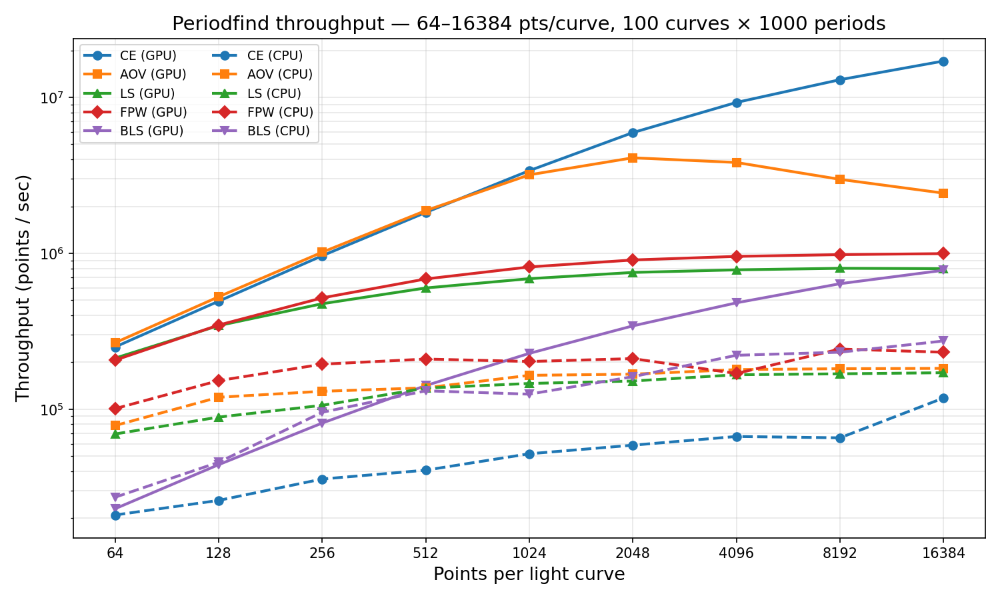

# PeriodFind

A collection of CUDA-accelerated periodicity detection algorithms, with both C++ and Python APIs. Includes a Rust-based CPU backend for environments without GPU hardware.

## Algorithms

### Period-Finding

| Algorithm | Unified API | GPU (CUDA) | CPU (Rust) |
|-----------|-------------|-----------|------------|
| Conditional Entropy | `periodfind.ConditionalEntropy` | `periodfind.gpu.ConditionalEntropy` | `periodfind.cpu.ConditionalEntropy` |
| Analysis of Variance | `periodfind.AOV` | `periodfind.gpu.AOV` | `periodfind.cpu.AOV` |
| Lomb-Scargle | `periodfind.LombScargle` | `periodfind.gpu.LombScargle` | `periodfind.cpu.LombScargle` |
| Fast Phase-folding Weighted | `periodfind.FPW` | `periodfind.gpu.FPW` | `periodfind.cpu.FPW` |
| Box Least Squares | `periodfind.BoxLeastSquares` | `periodfind.gpu.BoxLeastSquares` | `periodfind.cpu.BoxLeastSquares` |

### Feature Extraction

| Algorithm | Unified API | CPU (Rust) |
|-----------|-------------|------------|
| Fourier Decomposition | `periodfind.FourierDecomposition` | `periodfind.cpu.FourierDecomposition` |

Fourier decomposition computes weighted linear least-squares Fourier fits with BIC model selection (0-5 harmonics) for a batch of light curves given pre-determined periods. Returns 14 features per curve: `[power, BIC, offset, slope, A1, B1, A2, B2, A3, B3, A4, B4, A5, B5]`. This replaces the per-source `scipy.optimize.curve_fit` approach with a direct Cholesky solve, giving identical results orders of magnitude faster.

## Device API

Periodfind provides a PyTorch-style device abstraction so you can write device-agnostic code. When no device is set, it auto-detects GPU availability (tries to import the CUDA extensions and runs `nvidia-smi`).

```python
import periodfind

# Set the global default device
periodfind.set_device('cpu')   # or 'gpu'
print(periodfind.get_device()) # 'cpu'

# Factory functions dispatch to the right backend
ce  = periodfind.ConditionalEntropy(n_phase=10, n_mag=10)
aov = periodfind.AOV(n_phase=15)
ls  = periodfind.LombScargle()
fpw = periodfind.FPW(n_bins=10)
bls = periodfind.BoxLeastSquares(n_bins=50, qmin=0.01, qmax=0.5)
fd  = periodfind.FourierDecomposition()  # CPU-only for now

# Per-call override (ignores the global default)
ce_gpu = periodfind.ConditionalEntropy(n_phase=10, n_mag=10, device='gpu')
```

You can still import backends directly:

```python
from periodfind.gpu import ConditionalEntropy  # CUDA backend
from periodfind.cpu import ConditionalEntropy  # Rust CPU backend
from periodfind.cpu import FourierDecomposition  # Rust CPU only
```

### Box Least Squares Usage

BLS searches for periodic box-shaped (flat-bottom) transit dips in time-series data ([Kovacs, Zucker & Mazeh 2002](https://ui.adsabs.harvard.edu/abs/2002A%26A...391..369K)). It is particularly well-suited for detecting eclipsing binaries and transiting exoplanets.

```python
import numpy as np
import periodfind

bls = periodfind.BoxLeastSquares(
    n_bins=50,     # number of phase bins
    qmin=0.01,     # minimum transit duration (fraction of period)
    qmax=0.5,      # maximum transit duration (fraction of period)
)

# times, mags: lists of float32 arrays (one per light curve)
# errs: optional list of float32 uncertainty arrays
periods = np.linspace(0.5, 10.0, 5000, dtype=np.float32)
period_dts = np.array([0.0], dtype=np.float32)

# Get best-period statistics
stats = bls.calc(times, mags, periods, period_dts, errs=errs, output="stats")
print(stats[0].params[0])  # detected period

# Get full periodogram
pgrams = bls.calc(times, mags, periods, period_dts, output="periodogram")

# Get top-N peaks (memory-efficient for large grids)
peaks = bls.calc(times, mags, periods, period_dts, output="peaks", n_peaks=32)
```

### Fourier Decomposition Usage

```python
import numpy as np
import periodfind

fd = periodfind.FourierDecomposition()

# times, mags, errs: lists of float32 arrays (one per light curve)
# periods: float32 array with one period per curve
features = fd.calc(times, mags, errs, periods)
# features.shape == (n_curves, 14)
```

## Throughput Benchmarks

Measured on a batch of **100 light curves** over **1,000 trial periods** (single `period_dt`). CPU = Rust/Rayon on 2x Intel Xeon E5-2680 v4 (28 cores); GPU = NVIDIA Tesla P100 (12 GB). Times are median of 3 runs after warmup.

### Throughput table (points/sec)

| pts/curve | Backend | CE | AOV | LS | FPW | BLS |
|----------:|---------|---:|----:|---:|----:|----:|
| 256 | CPU | 36K | 130K | 106K | 194K | 95K |
| 256 | GPU | 964K | 1.0M | 475K | 517K | 81K |
| 256 | **Speedup** | **27x** | **7.8x** | **4.5x** | **2.7x** | **0.9x** |
| 1,024 | CPU | 52K | 165K | 146K | 202K | 125K |
| 1,024 | GPU | 3.4M | 3.2M | 687K | 817K | 228K |
| 1,024 | **Speedup** | **65x** | **19x** | **4.7x** | **4.0x** | **1.8x** |
| 4,096 | CPU | 67K | 179K | 166K | 169K | 222K |
| 4,096 | GPU | 9.3M | 3.8M | 783K | 955K | 481K |
| 4,096 | **Speedup** | **139x** | **21x** | **4.7x** | **5.6x** | **2.2x** |
| 16,384 | CPU | 118K | 183K | 171K | 232K | 274K |
| 16,384 | GPU | 17.1M | 2.4M | 797K | 995K | 778K |
| 16,384 | **Speedup** | **145x** | **13x** | **4.7x** | **4.3x** | **2.8x** |

### Throughput plot (log-log scale)



Solid lines = GPU (CUDA), dashed lines = CPU (Rust). The GPU advantage grows with light curve length for most algorithms, with CE showing the largest speedup (up to 145x). To reproduce, run `python benchmarks/throughput_bench.py` followed by `python benchmarks/plot_throughput.py`.

## Installing

### GPU backend (CUDA)

Requires CUDA installed with `nvcc` on your `PATH` (or set `$CUDA_HOME`).

```bash
pip install cython numpy
pip install -e .
```

### CPU backend (Rust)

Requires a Rust toolchain and [maturin](https://github.com/PyO3/maturin):

```bash
pip install maturin
cd rust && maturin develop --release
```

This builds the `periodfind.cpu` module using Rayon for multithreaded parallelism. No GPU needed.

### Python API

Ensure that `Cython` and `numpy` are both installed. Then, simply run:

```bash
python setup.py install
```

And periodfind should be installed!

### C++ API

First, ensure that CMake is installed, and that it is at least version `3.8`. Next, create a build directory for CMake to use, and `cd` into it:

```bash
mkdir cmakebuild
cd cmakebuild
```

Now, run CMake, and build the library:

```bash
cmake ..
make
```

Finally, install the package by running `make install` (may require super-user priveleges), which will install the library in `/usr/local/lib/` and the headers in `/usr/local/include/periodfind/` by default (on Linux, location will be different on other operating systems).

## Testing

Run the full test suite with pytest:

```bash
pytest tests/ -v
```

Tests are organized into four categories:

- **Unit tests** (`test_periodfind.py`): Statistics, Periodogram, and utility tests (no GPU or Rust needed)
- **CPU standalone tests** (`test_cpu_standalone.py`): Tests for the Rust CPU backend (period-finding algorithms)
- **Fourier tests** (`test_fourier.py`): Tests for Fourier decomposition (output shape, known signal recovery, edge cases, input validation)
- **GPU integration tests** (`test_cpu_vs_cuda.py`): CUDA algorithm tests (auto-skipped if no GPU is available)

To run only CPU tests (no GPU required):

```bash
pytest tests/test_periodfind.py tests/test_cpu_standalone.py tests/test_fourier.py -v
```

## CI

GitHub Actions runs CPU tests automatically on every push and PR. See `.github/workflows/tests.yml`. GPU tests run on self-hosted runners when available.

## Compatibility

This package has been tested only on Linux hosts running CUDA 10.2 and CUDA 11. Other operating systems and versions of CUDA may work, but it is not guaranteed.

## Acknowledgements

Funding for this project was provided by the Larson Scholar Fellowship as part of the SURF program.

## License

This package is licensed under the BSD 3-clause license. The copyright holder is the California Institute of Technology (Caltech).

`setup.py` and `MANIFEST.in` are based off of an example project at <https://github.com/rmcgibbo/npcuda-example/>, licensed under the BSD 2-clause license.
