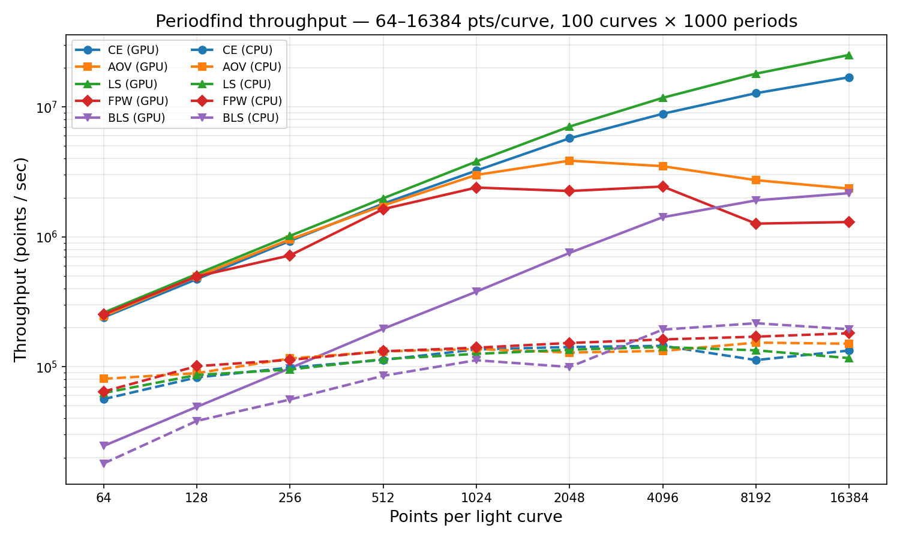

# PeriodFind

A collection of CUDA-accelerated periodicity detection algorithms, with both C++ and Python APIs. Includes a Rust-based CPU backend for environments without GPU hardware.

## Algorithms

### Period-Finding

| Algorithm | Unified API | GPU (CUDA) | CPU (Rust) |
|-----------|-------------|-----------|------------|
| Conditional Entropy | `periodfind.ConditionalEntropy` | `periodfind.gpu.ConditionalEntropy` | `periodfind.cpu.ConditionalEntropy` |
| Analysis of Variance | `periodfind.AOV` | `periodfind.gpu.AOV` | `periodfind.cpu.AOV` |
| Lomb-Scargle | `periodfind.LombScargle` | `periodfind.gpu.LombScargle` | `periodfind.cpu.LombScargle` |
| Fast Phase-folding Weighted | `periodfind.FPW` | `periodfind.gpu.FPW` | `periodfind.cpu.FPW` |
| Box Least Squares | `periodfind.BoxLeastSquares` | `periodfind.gpu.BoxLeastSquares` | `periodfind.cpu.BoxLeastSquares` |

### Feature Extraction

| Algorithm | Unified API | CPU (Rust) |
|-----------|-------------|------------|
| Fourier Decomposition | `periodfind.FourierDecomposition` | `periodfind.cpu.FourierDecomposition` |

Fourier decomposition computes weighted linear least-squares Fourier fits with BIC model selection (0-5 harmonics) for a batch of light curves given pre-determined periods. Returns 14 features per curve: `[power, BIC, offset, slope, A1, B1, A2, B2, A3, B3, A4, B4, A5, B5]`. This replaces the per-source `scipy.optimize.curve_fit` approach with a direct Cholesky solve, giving identical results orders of magnitude faster.

## Device API

Periodfind provides a PyTorch-style device abstraction so you can write device-agnostic code. When no device is set, it auto-detects GPU availability (tries to import the CUDA extensions and runs `nvidia-smi`).

```python
import periodfind

# Set the global default device
periodfind.set_device('cpu')   # or 'gpu'
print(periodfind.get_device()) # 'cpu'

# Factory functions dispatch to the right backend
ce  = periodfind.ConditionalEntropy(n_phase=10, n_mag=10)
aov = periodfind.AOV(n_phase=15)
ls  = periodfind.LombScargle()
fpw = periodfind.FPW(n_bins=10)
bls = periodfind.BoxLeastSquares(n_bins=50, qmin=0.01, qmax=0.5)
fd  = periodfind.FourierDecomposition()  # CPU-only for now

# Per-call override (ignores the global default)
ce_gpu = periodfind.ConditionalEntropy(n_phase=10, n_mag=10, device='gpu')
```

You can still import backends directly:

```python
from periodfind.gpu import ConditionalEntropy  # CUDA backend
from periodfind.cpu import ConditionalEntropy  # Rust CPU backend
from periodfind.cpu import FourierDecomposition  # Rust CPU only
```

### Box Least Squares Usage

BLS searches for periodic box-shaped (flat-bottom) transit dips in time-series data ([Kovacs, Zucker & Mazeh 2002](https://ui.adsabs.harvard.edu/abs/2002A%26A...391..369K)). It is particularly well-suited for detecting eclipsing binaries and transiting exoplanets.

```python
import numpy as np
import periodfind

bls = periodfind.BoxLeastSquares(
    n_bins=50,     # number of phase bins
    qmin=0.01,     # minimum transit duration (fraction of period)
    qmax=0.5,      # maximum transit duration (fraction of period)
)

# times, mags: lists of float32 arrays (one per light curve)
# errs: optional list of float32 uncertainty arrays
periods = np.linspace(0.5, 10.0, 5000, dtype=np.float32)
period_dts = np.array([0.0], dtype=np.float32)

# Get best-period statistics
stats = bls.calc(times, mags, periods, period_dts, errs=errs, output="stats")
print(stats[0].params[0])  # detected period

# Get full periodogram
pgrams = bls.calc(times, mags, periods, period_dts, output="periodogram")

# Get top-N peaks (memory-efficient for large grids)
peaks = bls.calc(times, mags, periods, period_dts, output="peaks", n_peaks=32)
```

### Fourier Decomposition Usage

```python
import numpy as np
import periodfind

fd = periodfind.FourierDecomposition()

# times, mags, errs: lists of float32 arrays (one per light curve)
# periods: float32 array with one period per curve
features = fd.calc(times, mags, errs, periods)
# features.shape == (n_curves, 14)
```

## Throughput Benchmarks

Measured on a batch of **100 light curves** over **1000 trial periods** (single `period_dt`). CPU = Rust/Rayon (28 cores, Skylake Xeon); GPU = NVIDIA Tesla P100 (12 GB). Times are median of 3 runs after warmup.

### Throughput table (points/sec)

| pts/curve | Backend | CE | AOV | LS | FPW | BLS |
|----------:|---------|---:|----:|---:|----:|----:|
| 256 | CPU | 140K | 184K | 146K | 245K | 121K |
| 256 | 1x P100 | 1.1M | 1.1M | 1.2M | 1.1M | 1.0M |
| 256 | 2x P100 | 1.1M | 1.2M | 1.4M | 1.2M | 1.2M |
| 1024 | CPU | 176K | 211K | 181K | 290K | 228K |
| 1024 | 1x P100 | 3.8M | 3.1M | 4.5M | 2.7M | 3.2M |
| 1024 | 2x P100 | 4.1M | 3.9M | 5.1M | 3.6M | 4.1M |
| 4096 | CPU | 185K | 217K | 194K | 307K | 293K |
| 4096 | 1x P100 | 9.8M | 3.2M | 13.2M | 3.5M | 6.2M |
| 4096 | 2x P100 | 12.7M | 5.6M | 16.5M | 6.1M | 9.6M |
| 8192 | CPU | 186K | 219K | 199K | 309K | 307K |
| 8192 | 1x P100 | 13.7M | 3.7M | 19.8M | 5.6M | 5.5M |
| 8192 | 2x P100 | 19.6M | 6.8M | 27.6M | 9.9M | 9.8M |

GPU kernels use a **hybrid atomic/privatization strategy** — shared-memory atomics for small point counts (low overhead, no register pressure) and per-thread register privatization with warp-shuffle reduction for large point counts (no atomic contention). This eliminates the throughput dip that pure privatization caused at small N, while preserving scalability at large N.

### Throughput plot (log-log scale)



Solid lines = 1x P100, dash-dot = 2x P100, dashed lines = CPU (Rust). All algorithms benefit from the GPU across the full range of point counts. LS reaches 20M pts/sec on 1x P100 at 8K points (100x over CPU). BLS reaches 5.5M pts/sec on 1x P100 (18x over CPU).

See the [full benchmarks page](https://zwickytransientfacility.github.io/periodfind/benchmarks/) for the full table, 2x P100 data, and methodology.

To reproduce, run `python benchmarks/throughput_bench.py` followed by `python benchmarks/plot_throughput.py`. Use `sbatch benchmarks/run_bench.sh` for multi-GPU benchmarks on a SLURM cluster.

## Installing

To complete the GPU installation, you need to install the CPU Backend (Rust).

Make sure you have loaded a cuda model and installed nvcc.

For DELTA users, you can follow these steps:

### Installation on DELTA

Create a conda environment and activate it.

```bash
conda create --name periodfind python=3.10
conda activate periodfind.
```

Pick a cuda model of your choice. 

```bash
module availd cuda
nvidia-smi
```
Load an available model.

```bash
module load cuda/12.8
```

GPU Backend for periodfind uses pycuda.

```bash
pip install pycuda
```

Check where module puts cuda.

```bash
echo $CUDA_HOME
```
Set the environment variables so the compiler can find cuda.

```bash
export CUDA_ROOT=$CUDA_HOME # or the output from echo $CUDA_HOME
export PATH=$CUDA_ROOT/bin:$PATH
export LD_LIBRARY_PATH=$CUDA_ROOT/lib64:$LD_LIBRARY_PATH
```

Install the dependencies.

```bash
pip install cython numpy
```

Clone the repository.

```bash
git clone https://github.com/scope-ml/periodfind.git
```


Install Rust toolchain.
```bash
curl --proto '=https' --tlsv1.2 -sSf https://sh.rustup.rs | sh
source $HOME/.cargo/env
```

Install maturin and build the CPU backend
```bash
pip install maturin
cd periodfind/rust
maturin develop --release
```

Run the installation for periodfind.
```bash
cd ..
pip install -e .
```

### GPU backend (CUDA)

Requires CUDA installed with `nvcc` on your `PATH` (or set `$CUDA_HOME`).

```bash
pip install cython numpy
pip install -e .
```

### CPU backend (Rust)

Requires a Rust toolchain and [maturin](https://github.com/PyO3/maturin):

```bash
pip install maturin
cd rust && maturin develop --release
```

This builds the `periodfind.cpu` module using Rayon for multithreaded parallelism. No GPU needed.

### Python API

Ensure that `Cython` and `numpy` are both installed. Then, simply run:

```bash
python setup.py install
```

And periodfind should be installed!

## Testing

Run the full test suite with pytest:

```bash
pytest tests/ -v
```

Tests are organized into four categories:

- **Unit tests** (`test_periodfind.py`): Statistics, Periodogram, and utility tests (no GPU or Rust needed)
- **CPU standalone tests** (`test_cpu_standalone.py`): Tests for the Rust CPU backend (period-finding algorithms)
- **Fourier tests** (`test_fourier.py`): Tests for Fourier decomposition (output shape, known signal recovery, edge cases, input validation)
- **GPU integration tests** (`test_cpu_vs_cuda.py`): CUDA algorithm tests (auto-skipped if no GPU is available)

To run only CPU tests (no GPU required):

```bash
pytest tests/test_periodfind.py tests/test_cpu_standalone.py tests/test_fourier.py -v
```

## CI

GitHub Actions runs CPU tests automatically on every push and PR. See `.github/workflows/tests.yml`. GPU tests run on self-hosted runners when available.

## Compatibility

This package has been tested only on Linux hosts running CUDA 10.2 and CUDA 11. Other operating systems and versions of CUDA may work, but it is not guaranteed.

## Acknowledgements

Funding for this project was provided by the Larson Scholar Fellowship as part of the SURF program.

## License

This package is licensed under the BSD 3-clause license. The copyright holder is the California Institute of Technology (Caltech).

`setup.py` and `MANIFEST.in` are based off of an example project at <https://github.com/rmcgibbo/npcuda-example/>, licensed under the BSD 2-clause license.
