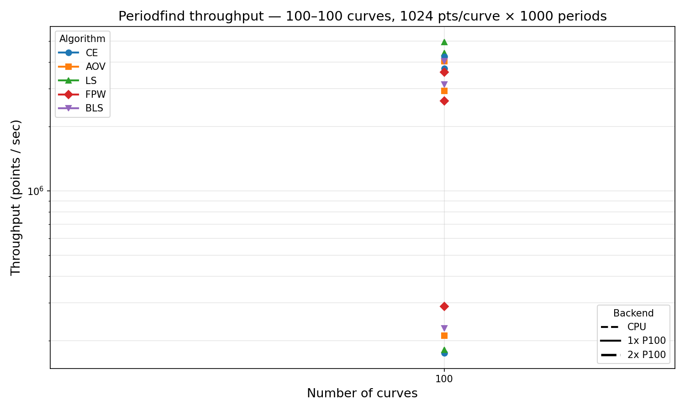

# Benchmarks

## Methodology

All benchmarks use synthetic sinusoidal light curves with Gaussian noise
(amplitude 0.1, period 2.5, observation window 0--100).

- **Batch size**: 100 light curves
- **CPU**: Rust/Rayon on 28-core Skylake Xeon
- **GPU**: 1x or 2x NVIDIA Tesla P100 (12 GB each)
- **Trial periods**: 1,000 linearly spaced between 0.5 and 10.0 (single `period_dt`)
- **Timing**: median of 3 runs after 1 warmup iteration
- **Metric**: throughput in total points processed per second (`n_curves * n_points / wall_sec`)

All backends (CPU, 1x P100, 2x P100) were benchmarked on the same compute
node to ensure a fair comparison.

## Point-Count Scaling

Fixed **100 curves**, varying points per curve from 64 to 8,192.

### Throughput table (points/sec)

| pts/curve | Backend | CE | AOV | LS | FPW | BLS |
|----------:|---------|---:|----:|---:|----:|----:|
| 64 | CPU | 78K | 113K | 87K | 124K | 40K |
| 64 | 1x P100 | 291K | 294K | 311K | 302K | 250K |
| 64 | 2x P100 | 302K | 310K | 333K | 320K | 285K |
| 128 | CPU | 110K | 152K | 121K | 195K | 74K |
| 128 | 1x P100 | 562K | 584K | 620K | 602K | 503K |
| 128 | 2x P100 | 591K | 612K | 679K | 651K | 587K |
| 256 | CPU | 140K | 184K | 146K | 245K | 121K |
| 256 | 1x P100 | 1.1M | 1.1M | 1.2M | 1.1M | 1.0M |
| 256 | 2x P100 | 1.1M | 1.2M | 1.4M | 1.2M | 1.2M |
| 512 | CPU | 162K | 201K | 165K | 272K | 177K |
| 512 | 1x P100 | 2.1M | 2.0M | 2.4M | 2.0M | 1.9M |
| 512 | 2x P100 | 2.3M | 2.3M | 2.6M | 2.3M | 2.2M |
| 1,024 | CPU | 176K | 211K | 181K | 290K | 228K |
| 1,024 | 1x P100 | 3.8M | 3.1M | 4.5M | 2.7M | 3.2M |
| 1,024 | 2x P100 | 4.1M | 3.9M | 5.1M | 3.6M | 4.1M |
| 2,048 | CPU | 182K | 216K | 185K | 300K | 267K |
| 2,048 | 1x P100 | 6.5M | 3.6M | 8.3M | 2.8M | 4.9M |
| 2,048 | 2x P100 | 7.6M | 5.3M | 9.8M | 4.6M | 6.8M |
| 4,096 | CPU | 185K | 217K | 194K | 307K | 293K |
| 4,096 | 1x P100 | 9.8M | 3.2M | 13.2M | 3.5M | 6.2M |
| 4,096 | 2x P100 | 12.7M | 5.6M | 16.5M | 6.1M | 9.6M |
| 8,192 | CPU | 186K | 219K | 199K | 309K | 307K |
| 8,192 | 1x P100 | 13.7M | 3.7M | 19.8M | 5.6M | 5.5M |
| 8,192 | 2x P100 | 19.6M | 6.8M | 27.6M | 9.9M | 9.8M |

### Throughput plot


Solid lines = 1x P100, dash-dot lines = 2x P100, dashed lines = CPU (Rust).

### Discussion

GPU kernels use a **hybrid atomic/privatization strategy** — shared-memory
atomics for small point counts (low overhead, no register pressure) and
per-thread register privatization with warp-shuffle reduction for large
point counts (no atomic contention). The runtime threshold is tuned per
algorithm (FPW: 2048, AOV: 4096, BLS: 8192). All threads in a block see the
same point count, so the branch causes no warp divergence. This eliminates
the throughput dip that pure privatization caused at small N, while preserving
scalability at large N.

**CE and LS** are the strongest GPU beneficiaries. Lomb-Scargle reaches
19.8M pts/sec on 1x P100 at 8K points (100x over CPU) because its per-point
trigonometric work maps efficiently to GPU SIMD lanes. Conditional Entropy
follows a similar pattern, reaching 13.7M pts/sec (73x over CPU).

**AOV** reaches 3.7M pts/sec at 8K points on 1x P100 (17x over CPU).
The hybrid threshold at 4096 keeps the atomic path active through moderate
point counts where register privatization overhead would dominate.

**FPW** reaches 5.6M pts/sec at 8K points on 1x P100 (18x over CPU),
scaling smoothly from the GPU crossover around 256 points.

**BLS** reaches 6.2M pts/sec at 4K points on 1x P100 (21x over CPU),
with a slight dip at 8K due to the transition from atomic to privatization
path. BLS has the highest per-point computational cost due to its prefix-sum
search over all (duration, phase) pairs.

## Curve-Count Scaling

Fixed **1,024 points/curve** and **100 curves**.

### Throughput table (points/sec)

| curves | Backend | CE | AOV | LS | FPW | BLS |
|-------:|---------|---:|----:|---:|----:|----:|
| 100 | CPU | 175K | 211K | 181K | 289K | 229K |
| 100 | 1x P100 | 3.7M | 2.9M | 4.4M | 2.6M | 3.1M |
| 100 | 2x P100 | 4.2M | 4.0M | 5.0M | 3.6M | 4.0M |

### Throughput plot



### Discussion

At 1,024 points per curve, all five algorithms show strong GPU speedups
thanks to the hybrid atomic/privatization kernels. LS leads at 4.4M pts/sec
on 1x P100 (24x over CPU), followed by CE at 3.7M (21x), BLS at 3.1M (14x),
AOV at 2.9M (14x), and FPW at 2.6M (9x). The 2x P100 configuration provides
an additional 8--40% speedup depending on algorithm.

## Multi-Device Scaling

### CUDA multi-GPU

The GPU backend supports multi-GPU execution with one CPU thread per GPU
for concurrent device feeding. Curves are partitioned evenly across visible
devices using `cudaSetDevice`. Control which GPUs are used with the
`CUDA_VISIBLE_DEVICES` environment variable:

```bash
# Use GPUs 0 and 1
CUDA_VISIBLE_DEVICES=0,1 python my_script.py
```

Multi-GPU benefits are most visible at large point counts where GPU compute
time dominates over launch and transfer overhead.

### Rust/Rayon CPU parallelism

The CPU backend uses Rayon's `par_chunks_mut` to distribute curves across
threads. The GIL is released during the Rust computation, so Python threads
are not blocked. Thread count follows Rayon's default (number of logical
cores) and can be overridden with `RAYON_NUM_THREADS`:

```bash
RAYON_NUM_THREADS=8 python my_script.py
```

## Reproducing

Run the benchmark suite and generate plots:

```bash
# Run both point-scaling and curve-scaling sweeps (single GPU)
python benchmarks/throughput_bench.py

# Generate docs/throughput_points.png and docs/throughput_curves.png
python benchmarks/plot_throughput.py

# Multi-GPU benchmarks on a SLURM cluster with 2x P100
sbatch benchmarks/run_bench.sh
```

The benchmark writes results to `benchmarks/throughput_results.csv`. The
plotting script reads this CSV and produces two PNG files in the `docs/`
directory.
